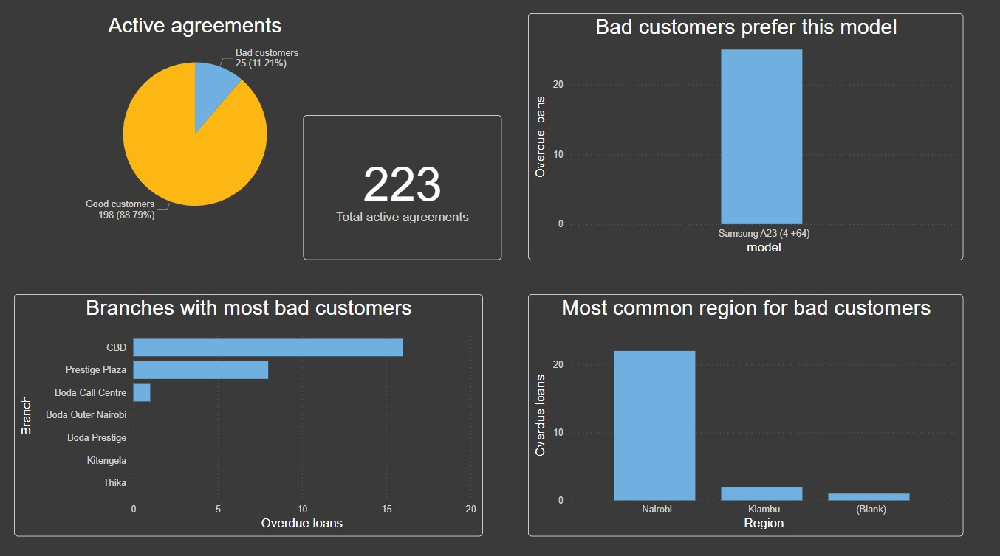

Dataset Description
This dataset represents a simplified customer acquisition funnel from lead generation to final agreement for phone loan company in Kenia. 

The data is structured across 4 sheets:
1.	Leads - Initial leads captured through various channels.
2.	Applications - Applications initiated by leads.
3.	Agreements - Signed agreements by clients who completed the funnel.
4.	Task - Tasks for Data analyst.

Conclusions and suggestions:
1.	All bad customers prefer this phone model: Samsung A23(4+ 64)
2.	Manager should stop giving this phone for the loans, as it generates only losses for the company.
3.	Especially not put this phone for the loans in Nairobi region or CBD branch.

## 📊 Dashboard Overview

### Chart Set 

