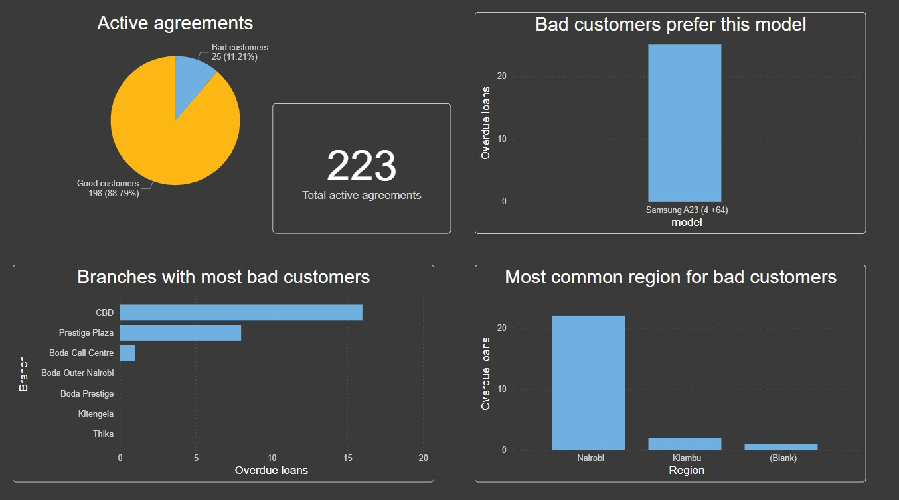

## Analysis of Phone loan company operations in Kenia, SQL and Power BI

This dataset represents a simplified customer acquisition funnel from lead generation to final agreement for phone loan company in Kenia. 

The data is structured across 4 sheets:
1.	Leads - Initial leads captured through various channels.
2.	Applications - Applications initiated by leads.
3.	Agreements - Signed agreements by clients who completed the funnel.
4.	Task - Tasks for Data analyst.

#### I used SQL queries to help me with analysis [View results folder](./Results/):
#### 1. To extract only loans coverted from leads not in Nairobi region. Is there anything interesting? 

select lead_id, lead_date, region, vehicle_model, l.application_id, 
agr.agreement_id, agr.status, agreement_created, term_in_weeks, model, bad_customer
from leads l
right join agreements agr on
l.application_id=agr.application_id
where region!='Nairobi';

#### 2. This would return result on how many loans are going to be repaid each week in 2023-2024.
SELECT 
  YEAR(STR_TO_DATE(agreement_created, '%d/%m/%Y')) + 1 AS year_load_paid,
  WEEK(STR_TO_DATE(agreement_created, '%d/%m/%Y'), 1) AS week_number,
  COUNT(*) AS total
FROM agreements
WHERE status = 'Active'
GROUP BY 
  YEAR(STR_TO_DATE(agreement_created, '%d/%m/%Y')) + 1,
  WEEK(STR_TO_DATE(agreement_created, '%d/%m/%Y'), 1)
ORDER BY year_load_paid, week_number;

### Conclusions and suggestions:
#### 1.	All bad customers prefer this phone model: Samsung A23(4+ 64)
#### 2.	Manager should stop approving loans for this phone model, as it generates only losses for the company.
#### 3.	Most risk of losses on this model loans would be in Nairobi region or CBD branch.

## 📊 Dashboard Overview

### Bad customers

